## Installing php:
------------------
* Manual steps:
---------------
[Refer Here](https://www.digitalocean.com/community/tutorials/how-to-install-linux-apache-mysql-php-lamp-stack-on-ubuntu-20-04#step-5-testing-php-processing-on-your-web-server) for the documentation for the installation steps of apache2 and php.
* Install 
     * apache2
     * php 
     * libapache2-mod-php 
     * php-mysql
* add `<?php
phpinfo();
?>`
to /var/www/your_domain/info.php 
* Then access the page with public-ip of the machine `http://<public-ip>/info.php` 
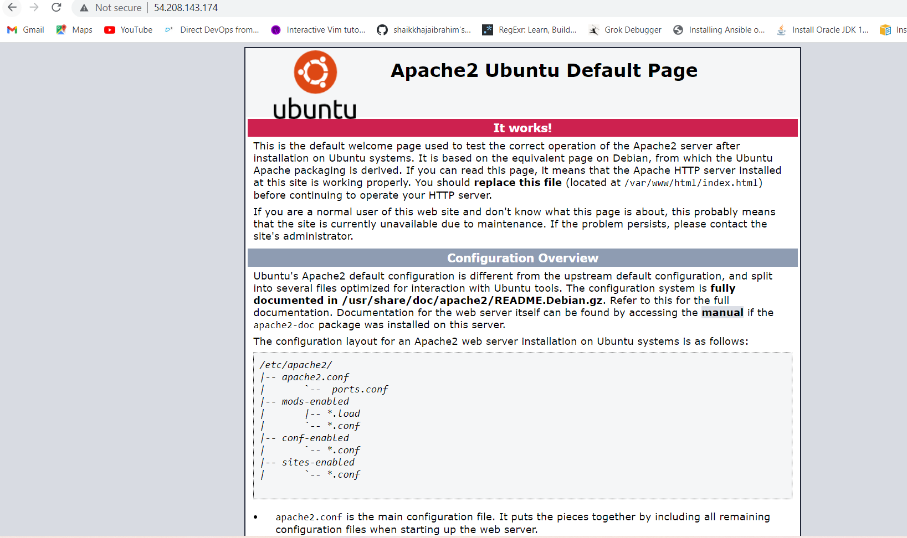
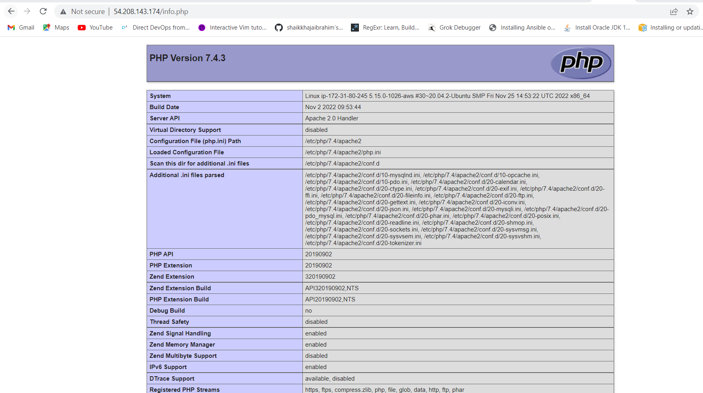

## Installing php from ansible playbook:
----------------------------------------
* Create two vm's and install python3(if the O.S. is ubuntu python3 is present by default) in both the vm's and ansible in one of the vm in which you wanted to make it as ansible master node.
* Then create an user with the same username in both the vm's and give sudo permissions for the user and change the 'PasswordAuthentication' to `yes` in `/etc/ssh/sshd_config` file and then restart the `sshd` service as we have done changes in the config file in both the vm's.
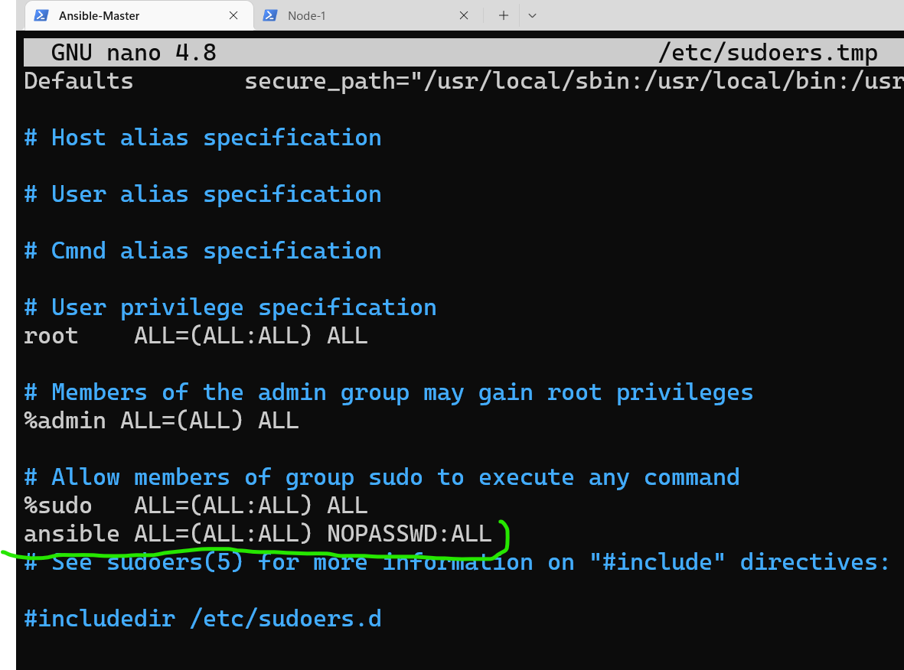
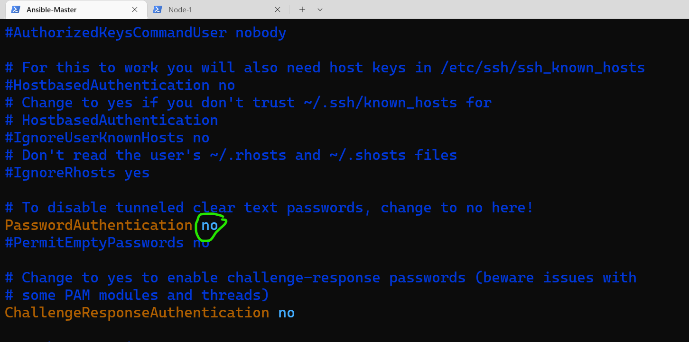
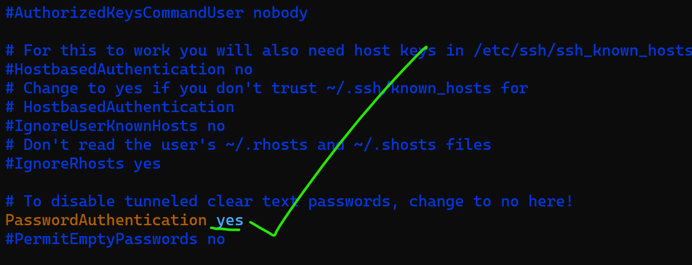
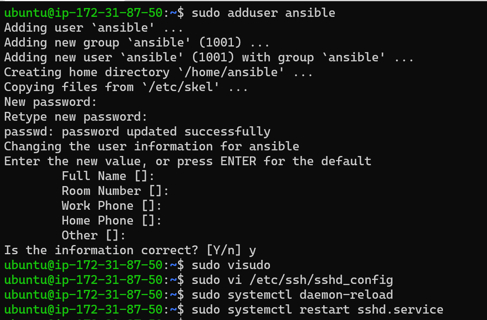
* Then log into the user and run any command to check wheather it is asking for password to run the command and it should not ask for password which we created before and create `ssh` key using `ssh-keygen` in the master and copy the key to the using `ssh-copy-id` to the node `ssh-copy-id <private-ip>` of the node
   * Note: we can also use public-ip but if we stop and start the machines the public-ip changes then we need to do the configuration again hence, it is better to go with private-ip as it remains same till we terminate the machine.
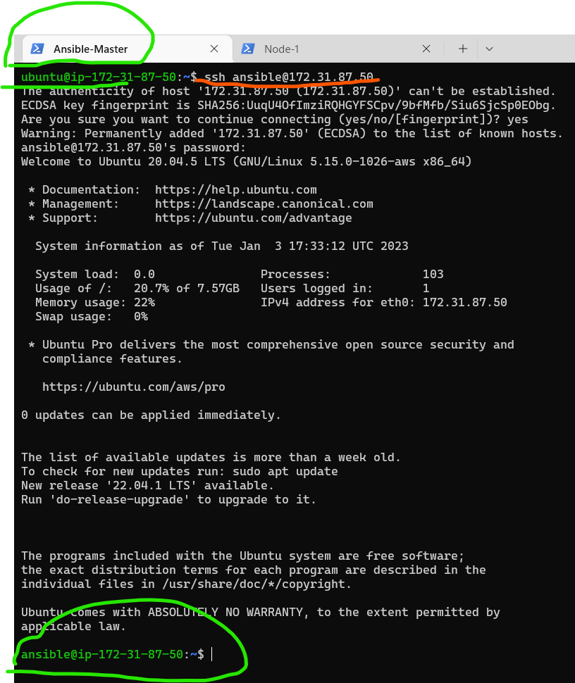
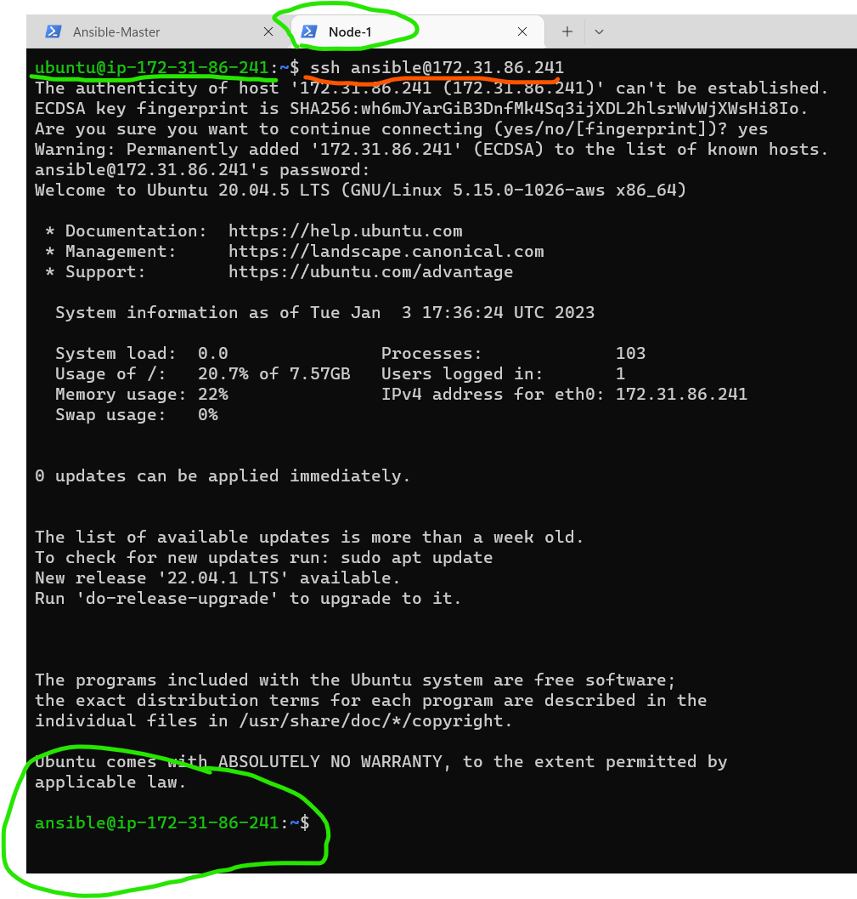
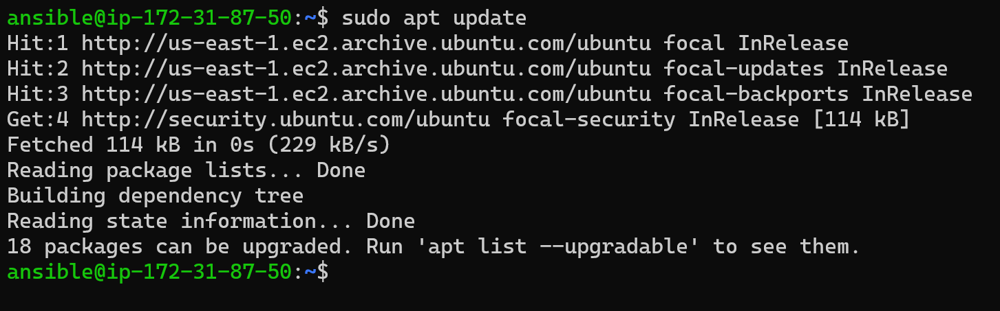
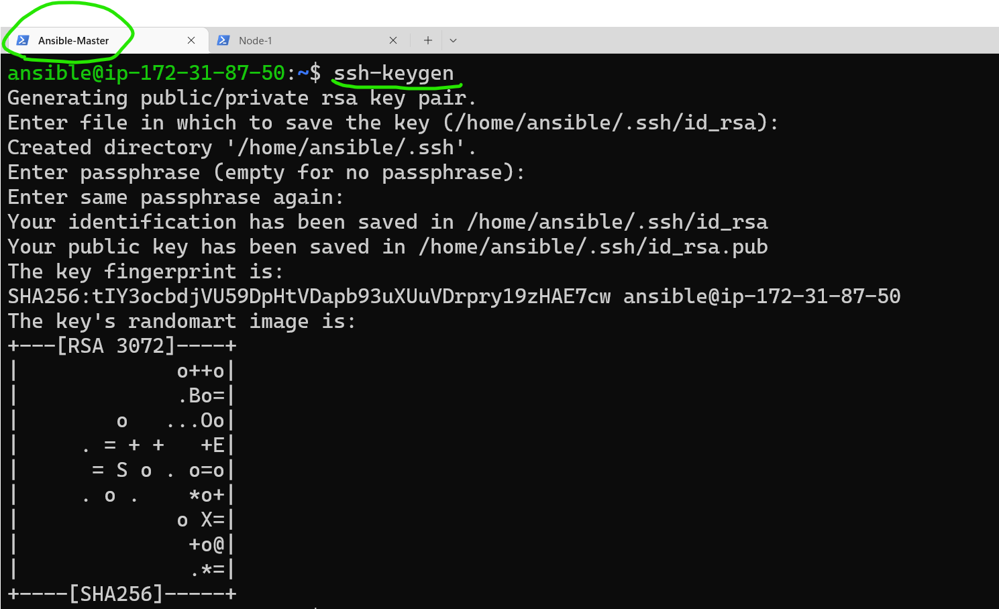
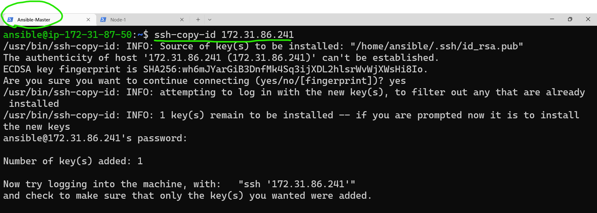
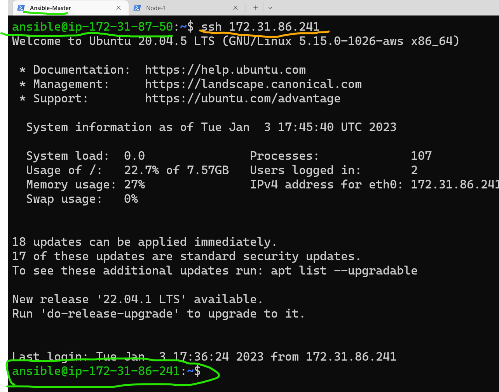
* After copying the ssh key then try to log in to the node from the master if the log is success then we can go to the next step.
* After successful log in create an inventory file(hosts) and add the ip address of the node and then ping with ansible to the node for connection between master and node using `ansible -m ping - i <name-of-the-inventory-file> <ip-of-the-nodes>/all` if the ansible ping is successful the set up is successful and we can run the playbooks.
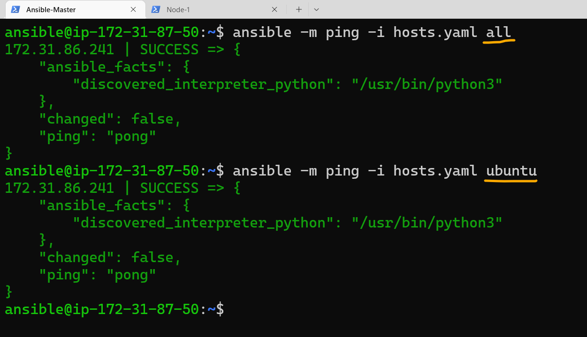

* Hosts file
```yaml
all:
  children:
    ubuntu:
      hosts:
        172.31.86.241:  
```
* Playbook for installing php
```yaml
--- 
- name: Installing php.info
  hosts: all 
  become: yes
  vars:
    php_file_path: ./info.php
    php_file_destination: /var/www/html/info.php
  tasks:
    - name: using debug
      ansible.builtin.debug:
        msg: Updating ubuntu packages and Installing apache2
    - name: updating the packages and installing apache2
      ansible.builtin.apt:
        name: 
          - apache2
          - php 
          - libapache2-mod-php 
          - php-mysql
        update_cache: yes
        state: present
    - name: using debug
      ansible.builtin.debug:
        msg: copying info.php to node 
    - name: copying info.php file
      ansible.builtin.copy:
        src: "{{ php_file_path }}" 
        dest: "{{ php_file_destination }}"
    - name: using debug
      ansible.builtin.debug:
        msg: starting apache2 service    
    - name: starting apache2
      ansible.builtin.systemd:  
        name: apache2
        enabled: yes
        state: started    
```
* Apply the playbook using `ansible-playbook -i <name-of-the-hosts-file> <name-of- the-playbook>`
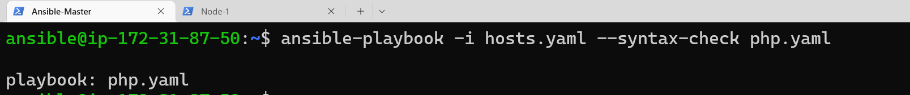
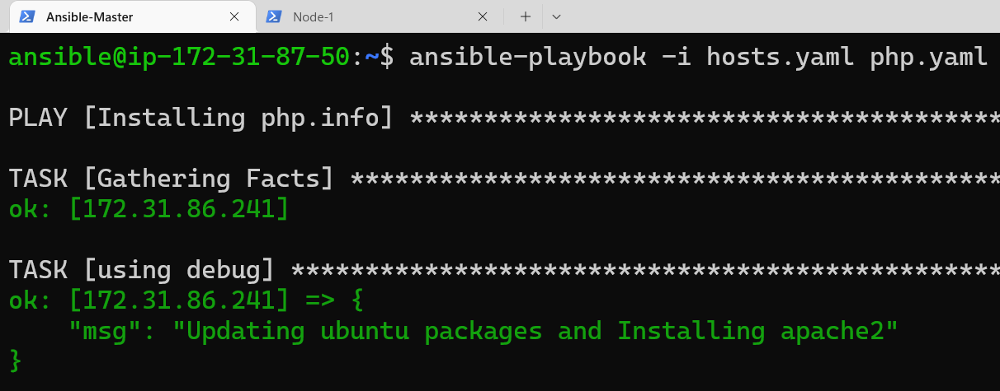
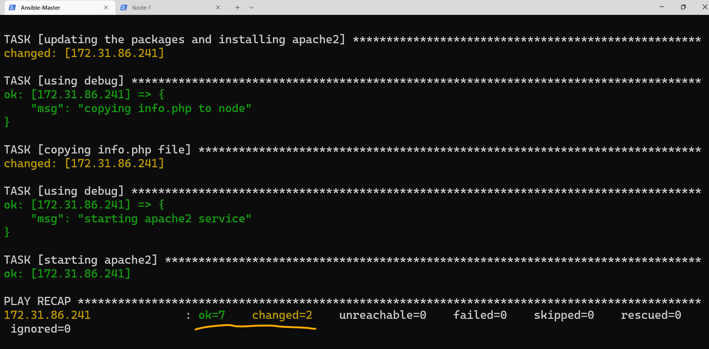
* Now re-run the playbook again this time it should not have any changes
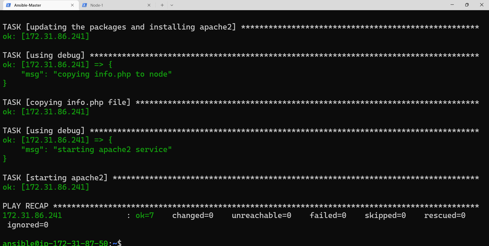
* Now access the php application using the public-ip of node
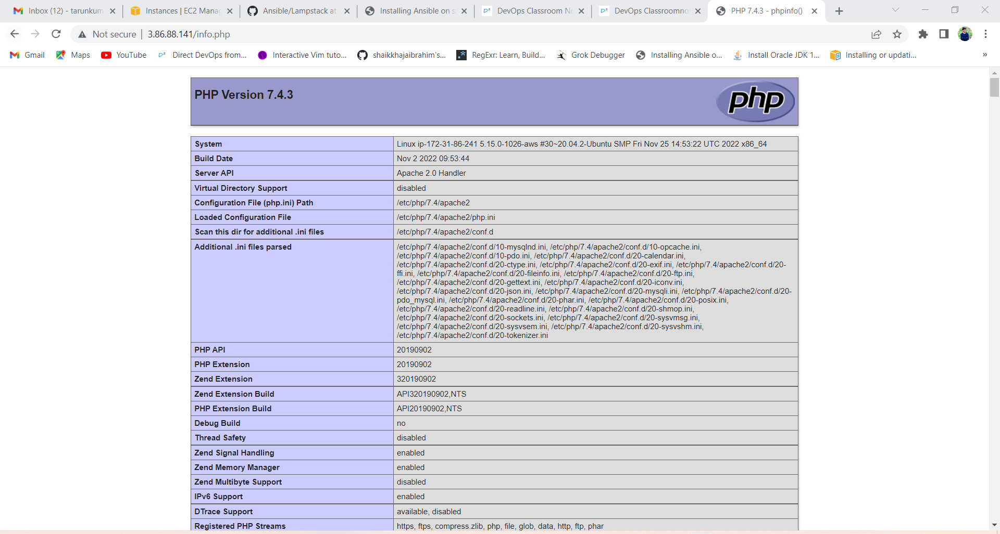